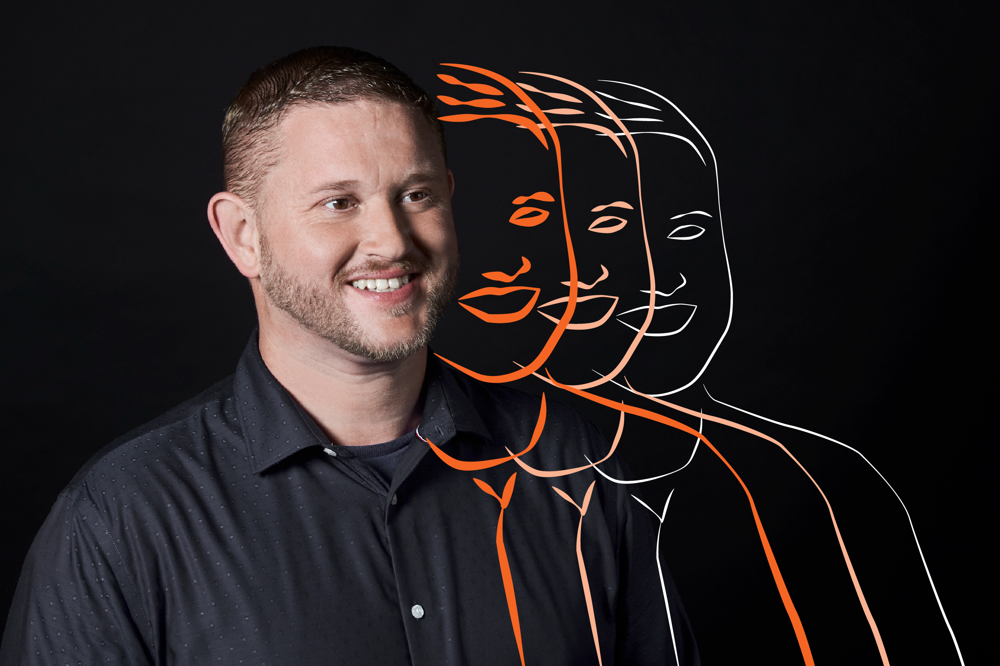

# Personal Portfolio
>  This site contains information about an up and coming web developer, Allen Lovatt. It features his previous work, contact information and a recent photo. All on a responsive design.

## Table of contents
* [General info](#general-info)
* [Screenshots](#screenshot)
* [Technologies](#technologies)
* [Setup](#setup)
* [Features](#features)
* [Status](#status)
* [Contact](#contact)

## General info
Second weekly assignment due on Sunday December 13, 2020 @ 11:59 PM.
## Screenshot

## Technologies
* HTML
* CSS

## Setup
Clone files into your own root directory, file extensions are relative and will operate normally.

## Code Examples
Show examples of usage:

HTML:

<section id="about" class="about">
                      

            
                        <article class="aboutme">
                            <h2>
                                About Me
                              </h2>
                             
                          
                          

                            <h3 class="allen-name">Allen Lovatt</h3>
                            <h4 class="allen-role">Efficient, Fast and Accurate.</h4>
                            
With no previous coding experience, this course has taught me so much in just a few short weeks. I'm excited to see what I can accomplish by the time we've completed.

                          

                        </article>
                
                </section>

CSS:
  .about {
    margin: 20px;
    flex: 1;
    background:  #414249;
    color: white;
    display: flex;
    text-align: center;
    font-family: 'Trebuchet MS';
    border-bottom: 10px solid #414249;
    font-family: 'Courier New', monospace;
  }

## Features
List of features
* Navigation Bar Linked To Appropriate Site Locations
* Grids Used to Display Images
* HTML and CSS Optimization for Peak Performance and Storage Requirements and Responsive Design

To-do list:
* Future projects to be added.

## Status
Project is: completed. Assignment ready for submission.

## Contact
Created by Allen Lovatt - allenlovatt@gmail.com
